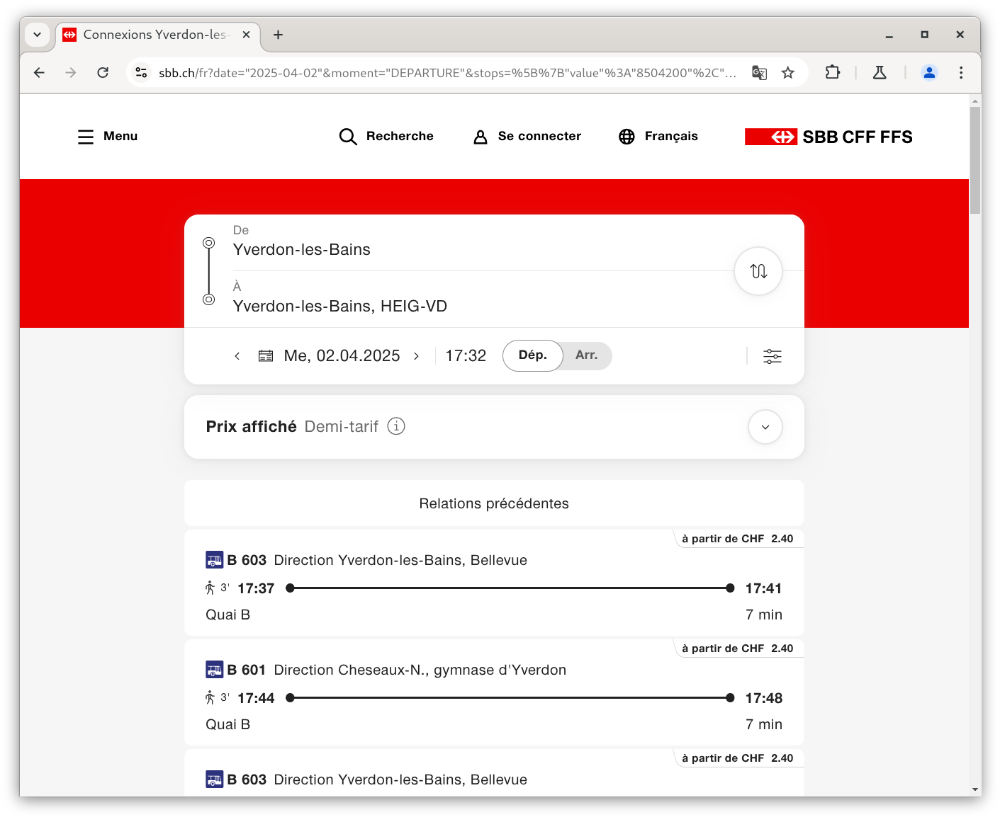

<!--
theme: gaia
size: 16:9
paginate: true
author: L. Delafontaine et V. Guidoux, avec l'aide de GitHub Copilot
title: HEIG-VD MVP Course - Réaliser des interfaces ergonomiques et réfléchies
description: Réaliser des interfaces ergonomiques et réfléchies pour le cours MVP à la HEIG-VD, Suisse
url: https://heig-vd-mvp-course.github.io/heig-vd-mvp-course/09-cours-realiser-des-interfaces-ergonomiques-et-reflechies/01-presentation/index.html
header: "**Réaliser des interfaces ergonomiques et réfléchies**"
footer: "**HEIG-VD** - MVP Course 2024-2025 - CC BY-SA 4.0"
style: |
    :root {
        --color-background: #fff;
        --color-foreground: #333;
        --color-highlight: #f96;
        --color-dimmed: #888;
        --color-headings: #7d8ca3;
    }
    blockquote {
        font-style: italic;
    }
    table {
        width: 100%;
    }
    h1, h2, h3, h4, h5, h6 {
        color: var(--color-headings);
    }
    h2, h3, h4, h5, h6 {
        font-size: 1.5rem;
    }
    h1 a:link, h2 a:link, h3 a:link, h4 a:link, h5 a:link, h6 a:link {
        text-decoration: none;
    }
    section:not(.lead) > p, blockquote {
        text-align: justify;
    }
    section:has(h1) {
        padding: 50px;
    }
    section:has(h1) > header {
        display: none;
    }
    section > header {
        font-size: 50%;
    }
    .two-columns {
        display: grid;
        grid-template-columns: 1fr 1fr;
        gap: 1rem;
    }
headingDivider: 6
-->

# Réaliser des interfaces ergonomiques et réfléchies

<!--
_class: lead
_paginate: false
-->

<https://github.com/heig-vd-mvp-course>

[Web][web] · [PDF][pdf]

<small>L. Delafontaine et V. Guidoux, avec l'aide de GitHub Copilot</small>

<small>Ce travail est sous licence [CC BY-SA 4.0][license].</small>

![bg opacity:0.25][illustration-principale]

## Plus de détails dans le support de cours

<!-- _class: lead -->

_Cette présentation est un résumé du support de cours. Pour plus de détails,
consultez le [support de cours][course-material]._

## Objectifs (1/2)

- Décrire les éléments clés qui composent une interface ergonomique et réfléchie
- Identifier dans une interface quels sont les éléments ergonomiques et
  réfléchies ou non
- Lister les outils qui permettent de concevoir une interface ergonomique et
  réfléchie

![bg right:40%][illustration-objectifs]

## Objectifs (2/2)

- Lister les outils qui permettent de valider qu'une interface est accessible et
  ergonomique

![bg right:40%][illustration-objectifs]

## Avertissement

- Développer des interfaces ergonomiques et réfléchies est un métier à part
  entière
- Longues années d'études et d'expérience
- Nous ne sommes pas des experts
- De ce fait, nous allons vous transmettre dans ce cours est une introduction à
  ce domaine

![bg right:40%][illustration-avertissement]

## Qu'est-ce qu'une interface ergonomique et réfléchie ? (1/2)

- Une interface qui est facile à utiliser et à comprendre
- Une interface qui est agréable à utiliser et accessible à tous
- Minimise les erreurs et maximise la satisfaction et l'engagement

![bg right:40%][illustration-principale]

## Qu'est-ce qu'une interface ergonomique et réfléchie ? (2/2)

Basé sur quelques principes de design (bon sens/subjectifs):

- Visibilité
- Feedback
- Flexibilité
- Simplicité
- Clarté

- Consistance
- Accessibilité
- Esthétique
- Efficacité

## Comment réaliser une interface ergonomique et réfléchie ?

On peut utiliser la méthode suivante pour réaliser une interface ergonomique et
réfléchie :

1. Définir les besoins de l'utilisateur
2. Définir les objectifs et fonctionnalités de l'application
3. Définir les éléments, structure et design, de l'interface
4. Définir les interactions de l'interface
5. Définir les tests utilisateurs et accessibilité

## Exemples d'interfaces que nous ne trouvons pas ergonomiques et réfléchies

Voici quelques exemples d'interfaces que nous ne trouvons pas ergonomiques et
réfléchies.

Nous allons les analyser ensemble.

### [Garmin Connect](https://connect.garmin.com/)

**Les points positifs**

- Beaucoup de statistiques
- Interface simple pour créer des entraînements

**Les points négatifs**

- Interface peu intuitive
- Navigation peu efficace

### [Discord](https://discord.com/)

**Les points positifs**

- Application complète et riche en fonctionnalités

**Les points négatifs**

- Interface très chargée
- Difficulté à trouver ce que l'on cherche

### [X/Twitter](https://x.com/)

**Les points positifs**

- Application simple et efficace

**Les points négatifs**

- Sans compte, l'application est quasi inutilisable
- "Nagging" pour créer un compte

## Exemples d'interfaces que nous trouvons ergonomiques et réfléchies

Voici quelques exemples d'interfaces que nous trouvons ergonomiques et
réfléchies.

Nous allons les analyser ensemble.

 

### [WhatsApp](https://www.whatsapp.com/)

**Les points positifs**

- Application très simple et très efficace : réalise une seule tâche à la
  perfection

**Les points négatifs**

- Peu de possibilité de personnaliser l'interface

### [CFF](https://www.cff.ch/)

**Les points positifs**

- Application très sobre et bien structurée

**Les points négatifs**

- Difficulté à acheter des billets internationaux
- Trop de types de billets

### [Loading Artist](https://loadingartist.com/)

**Les points positifs**

- Interface simple et efficace pour consulter des bandes dessinée

**Les points négatifs**

- Interface très simple, mais peut-être trop chargée ?

## Outils pour concevoir une interface ergonomique et réfléchie

- Papier et crayon (old-school mais souvent le plus efficace)
- [Figma](https://www.figma.com/)
- [Penpot](https://penpot.app/) (une alternative open-source à Figma)
- [Balsamiq](https://balsamiq.com/)
- [Wireframe.cc](https://wireframe.cc/)
- [Adobe Illustrator](https://www.adobe.com/products/illustrator.html)
- [Adobe Photoshop](https://www.adobe.com/products/photoshop.html)

## Outils pour valider qu'une interface est accessible et ergonomique

- Contrastes
- Palettes de couleurs / Charte graphique
- Accessibilité

### Validation des contrastes et palettes de couleurs

- **Poline** : palette de couleurs et validation des contrastes
- **Geenes Accessibility Editor** : éditeur de couleurs et validation des
  contrastes

![bg right:40%][illustration-contrastes]

### Outils généraux d'accessibilité web

- **WAVE Evaluation Tool**: analyseur d'accessibilité web
- **Lighthouse**: outil d'audit de performance et d'accessibilité

![bg right:40%][illustration-accessibilite]

## Questions

<!-- _class: lead -->

Est-ce que vous avez des questions ?

## À vous de jouer !

- Prendre connaissance du [support de cours][course-material]
- Poser des questions si nécessaire

![bg right:40%][illustration-a-vous-de-jouer]

## Sources (1/3)

- [Illustration principale][illustration-principale] par
  [Samule Sun](https://unsplash.com/@samule) sur
  [Unsplash](https://unsplash.com/photos/grey-desk-lamp-on-top-of-office-desk-U6EXlQCZ938)
- [Illustration][illustration-objectifs] par
  [Aline de Nadai](https://unsplash.com/@alinedenadai) sur
  [Unsplash](https://unsplash.com/photos/j6brni7fpvs)
- [Illustration][illustration-avertissement] par
  [Bernard Hermant](https://unsplash.com/@bernardhermant) sur
  [Unsplash](https://unsplash.com/photos/white-and-black-signage-mountain-on-wall--iVnye8VaHY)
- [Illustration][illustration-a-vous-de-jouer] par
  [Nikita Kachanovsky](https://unsplash.com/@nkachanovskyyy) sur
  [Unsplash](https://unsplash.com/photos/white-sony-ps4-dualshock-controller-over-persons-palm-FJFPuE1MAOM)
- [Illustration][illustration-accessibilite] par
  [Elena Mozhvilo](https://unsplash.com/@miracleday) sur
  [Unsplash](https://unsplash.com/photos/gold-and-silver-round-frame-magnifying-glass-j06gLuKK0GM)
- [Illustration][illustration-contrastes] par
  [Elena Mozhvilo](https://unsplash.com/@miracleday) sur
  [Unsplash](https://unsplash.com/photos/yellow-flower-in-tilt-shift-lens-FCdi9-5EG_c)

<!-- URLs -->

[web]:
	https://heig-vd-mvp-course.github.io/heig-vd-mvp-course/09-cours-realiser-des-interfaces-ergonomiques-et-reflechies/01-presentation/
[pdf]:
	https://heig-vd-mvp-course.github.io/heig-vd-mvp-course/09-cours-realiser-des-interfaces-ergonomiques-et-reflechies/01-presentation/09-cours-realiser-des-interfaces-ergonomiques-et-reflechies-presentation.pdf
[course-material]:
	https://github.com/heig-vd-mvp-course/heig-vd-mvp-course/blob/main/09-cours-realiser-des-interfaces-ergonomiques-et-reflechies/02-support-de-cours/README.md
[license]:
	https://github.com/heig-vd-mvp-course/heig-vd-mvp-course/blob/main/LICENSE.md

<!-- Illustrations -->

[illustration-principale]:
	https://images.unsplash.com/photo-1524820801657-fd59673fbb05?fit=crop&h=720
[illustration-objectifs]:
	https://images.unsplash.com/photo-1516389573391-5620a0263801?fit=crop&h=720
[illustration-avertissement]:
	https://images.unsplash.com/photo-1520414283774-cd4cb599a987?fit=crop&h=720

---

[illustration-a-vous-de-jouer]:
	https://images.unsplash.com/photo-1509198397868-475647b2a1e5?fit=crop&h=720
[illustration-accessibilite]:
	https://images.unsplash.com/photo-1587740896339-96a76170508d?fit=crop&h=720
[illustration-contrastes]:
	https://images.unsplash.com/photo-1588939240288-854695a834d1?fit=crop&h=720
