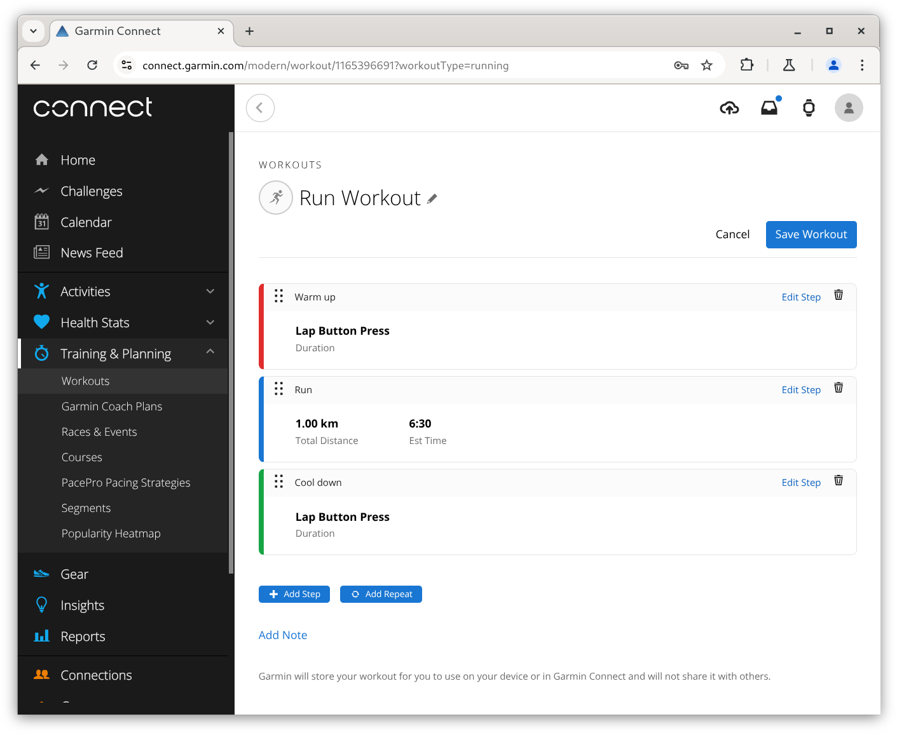
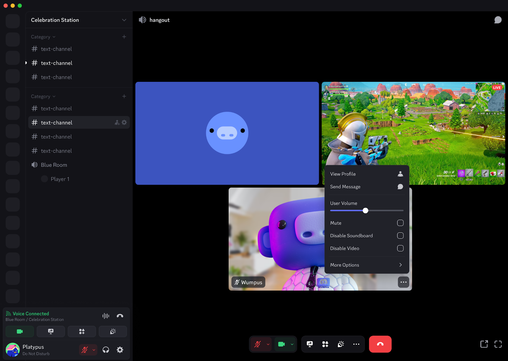
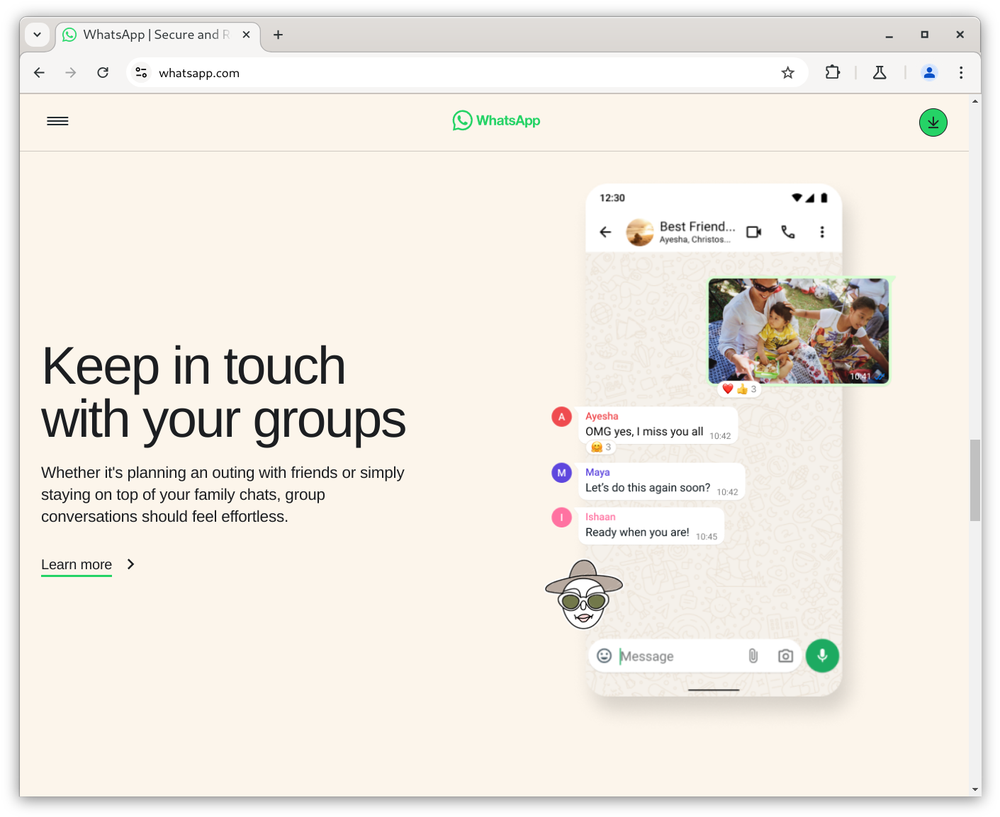
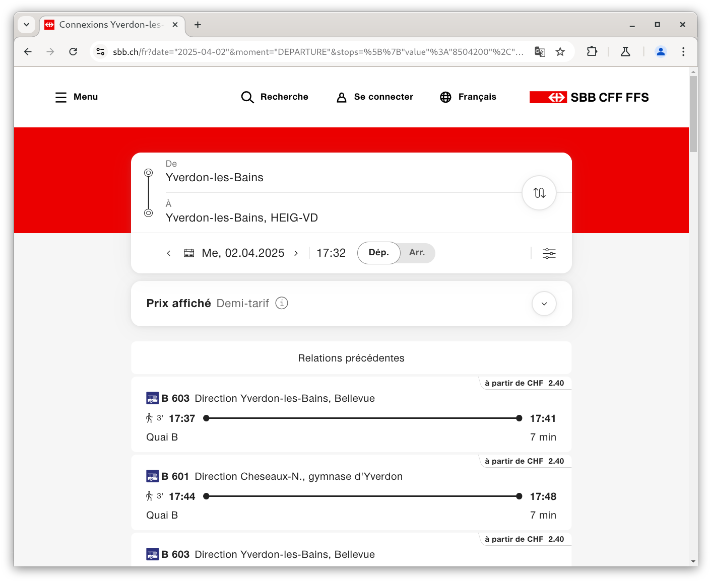
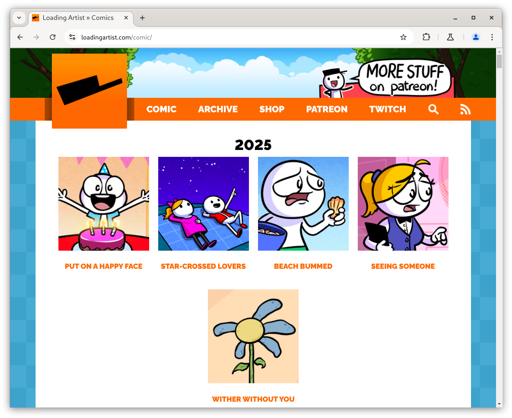

# Réaliser des interfaces ergonomiques et réfléchies - Support de cours

<https://github.com/heig-vd-mvp-course>

[Markdown][course-material]

L. Delafontaine et V. Guidoux, avec l'aide de GitHub Copilot

Ce travail est sous licence [CC BY-SA 4.0][license].

![Illustration principale][illustration-principale]

## Table des matières

- [Table des matières](#table-des-matières)
- [Objectifs](#objectifs)
- [Avertissement](#avertissement)
- [Qu'est-ce qu'une interface ergonomique et réfléchie ?](#quest-ce-quune-interface-ergonomique-et-réfléchie-)
- [Comment réaliser une interface ergonomique et réfléchie ?](#comment-réaliser-une-interface-ergonomique-et-réfléchie-)
- [Exemples d'interfaces que nous ne trouvons pas ergonomiques et réfléchies](#exemples-dinterfaces-que-nous-ne-trouvons-pas-ergonomiques-et-réfléchies)
  - [Garmin Connect](#garmin-connect)
  - [Discord](#discord)
  - [X/Twitter](#xtwitter)
- [Exemples d'interfaces que nous trouvons ergonomiques et réfléchies](#exemples-dinterfaces-que-nous-trouvons-ergonomiques-et-réfléchies)
  - [WhatsApp](#whatsapp)
  - [CFF](#cff)
  - [Loading Artist](#loading-artist)
- [Outils pour concevoir une interface ergonomique et réfléchie](#outils-pour-concevoir-une-interface-ergonomique-et-réfléchie)
- [Outils pour valider qu'une interface est accessible et ergonomique](#outils-pour-valider-quune-interface-est-accessible-et-ergonomique)
  - [Validation des contrastes et palettes de couleurs](#validation-des-contrastes-et-palettes-de-couleurs)
  - [Outils généraux d'accessibilité web](#outils-généraux-daccessibilité-web)
- [Conclusion](#conclusion)
- [Ce que vous ferez ensuite](#ce-que-vous-ferez-ensuite)
- [Sources](#sources)

## Objectifs

Réaliser des interfaces ergonomiques et réfléchies est une tâche complexe qui
nécessite de prendre en compte de nombreux aspects.

Elles permettent à l'utilisateur de comprendre rapidement comment interagir avec
l'application, de minimiser les erreurs et de maximiser la satisfaction et
l'engagement.

Dans cette séance, nous allons voir comment réaliser des interfaces ergonomiques
et réfléchies.

De façon plus concise, à la fin de cette séance, vous devriez être capable de :

- Décrire les éléments clés qui composent une interface ergonomique et réfléchie
- Identifier dans une interface quels sont les éléments ergonomiques et
  réfléchies ou non
- Lister les outils qui permettent de concevoir une interface ergonomique et
  réfléchie
- Lister les outils qui permettent de valider qu'une interface est accessible et
  ergonomique

## Avertissement

Développer des interfaces ergonomiques et réfléchies est un métier à part
entière (UI/UX Designer). Il s'agit de longues formations et de nombreuses
années d'expérience pour devenir une personne experte en la matière.

Développer des interfaces ergonomiques demande des compétences en design
graphique, en psychologie cognitive, en ergonomie, en expérience utilisateur, en
développement web, en accessibilité, en tests utilisateurs, etc.

De ce fait, ce que nous allons vous transmettre dans ce cours est une
introduction à ce domaine. Nous vous donnerons des bases pour vous permettre de
développer des interfaces ergonomiques et réfléchies, mais nous ne nous
considérons pas comme des personnes expertes en la matière.

## Qu'est-ce qu'une interface ergonomique et réfléchie ?

Une interface ergonomique et réfléchie est une interface qui permet à
l'utilisateur de comprendre rapidement comment interagir avec l'application.

De part sa conception, elle minimise les erreurs et maximise la satisfaction et
l'engagement de l'utilisateur.

Pour cela, une interface ergonomique et réfléchie doit respecter plusieurs
principes :

- **Visibilité** : l'utilisateur doit comprendre rapidement comment interagir
  avec l'application
- **Feedback** : l'application doit donner un retour à l'utilisateur suite à une
  action
- **Flexibilité** : l'application doit s'adapter à l'utilisateur
- **Simplicité** : l'application doit être simple à utiliser
- **Clarté** : l'application doit être claire
- **Consistance** : l'application doit être consistante
- **Accessibilité** : l'application doit être accessible à tout le monde
- **Esthétique** : l'application doit être esthétique
- **Efficacité** : l'application doit être efficace

Beaucoup de ces principes sont issus de la psychologie cognitive et de
l'ergonomie et sont, pour la plupart, des principes de bon sens et/ou
subjectifs, ce qui rend leur application difficile.

Il est donc important de garder à l'esprit que ces principes ne sont pas des
règles absolues, mais des recommandations qui doivent être adaptées à chaque
situation.

## Comment réaliser une interface ergonomique et réfléchie ?

Pour réaliser une interface ergonomique et réfléchie, il est nécessaire de
respecter les principes énoncés ci-dessus.

Pour cela, il est possible de suivre plusieurs étapes :

1. **Définir les besoins de l'utilisateur** : il est nécessaire de comprendre
   qui sont les utilisateurs de l'application et quels sont leurs besoins
2. **Définir les objectifs de l'application** : il est nécessaire de comprendre
   quels sont les objectifs de l'application
3. **Définir les fonctionnalités de l'application** : il est nécessaire de
   comprendre quelles sont les fonctionnalités de l'application
4. **Définir les éléments de l'interface** : il est nécessaire de définir les
   éléments de l'interface
5. **Définir la structure de l'interface** : il est nécessaire de définir la
   structure de l'interface à l'aide de wireframes
6. **Définir le design de l'interface** : il est nécessaire de définir le design
   de l'interface à l'aide de maquettes (mockups)
7. **Définir les interactions de l'interface** : il est nécessaire de définir
   les interactions de l'interface à l'aide de prototypes
8. **Définir les tests utilisateurs** : il est nécessaire de définir les tests
   utilisateurs pour valider l'interface
9. **Définir les tests d'accessibilité** : il est nécessaire de définir les
   tests d'accessibilité pour valider l'accessibilité de l'interface

Puis, de façon itérative, vous pouvez recommencer ces étapes pour améliorer
l'interface.

Pour réaliser ces étapes, il est possible d'utiliser plusieurs outils :

- **Wireframes** : pour définir la structure de l'interface
- **Maquettes (mockups)** : pour définir le design de l'interface
- **Prototypes** : pour tester les interactions de l'interface avec des
  utilisateurs

## Exemples d'interfaces que nous ne trouvons pas ergonomiques et réfléchies

### Garmin Connect

Garmin Connect est l'application de suivi d'activité de Garmin. Elle permet de
suivre ses activités sportives et d'obtenir des statistiques sur ses
performances.

L'application est riche en fonctionnalités, mais l'interface ne permet pas une
navigation efficace.

Les points positifs :

- Beaucoup de statistiques
- Interface simple pour créer des entraînements

Les points négatifs :

- Interface peu intuitive
- Navigation peu efficace

### Discord

Qui n'a jamais raccroché un appel vidéo sur [Discord](https://discord.com/)
plutôt que d'arrêter de regarder un stream ou arrêter de partager l'écran ? Il
est vrai que l'interface de Discord est très chargée et qu'il n'est pas toujours
évident de trouver ce que l'on cherche.

Les points positifs :

- Application complète et riche en fonctionnalités

Les points négatifs :

- Interface très chargée
- Difficulté à trouver ce que l'on cherche

Depuis le 25 mars 2025, l'application a été mise à jour et l'interface a été
révisée. Nous verrons à l'utilisation si cette mise à jour a été bénéfique ou
non.

### X/Twitter

L'application [X/Twitter](https://x.com/) est un réseau social qui permet de
partager des messages courts (tweets) et de suivre des personnes.

L'application se veut simple et efficace, mais si l'on est pas connecté, il est
quasi impossible d'accéder au contenu de l'application.

Les points positifs :

- Application simple et efficace

Les points négatifs :

- Sans compte, l'application est quasi inutilisable
- "Nagging"[^nagging-wikipedia] pour créer un compte

## Exemples d'interfaces que nous trouvons ergonomiques et réfléchies

### WhatsApp

L'application [WhatsApp](https://www.whatsapp.com/) est une application de
messagerie instantanée qui permet d'envoyer des messages, des photos, des
vidéos, des fichiers audio et des fichiers.

L'application est simple et efficace, et permet de discuter avec ses amis et sa
famille.

Les points positifs :

- Application très simple et très efficace : réalise une seule tâche à la
  perfection

Les points négatifs :

- Peu de possibilité de personnaliser l'interface

### CFF

L'application [CFF](https://www.cff.ch/) est l'application des Chemins de fer
fédéraux suisses. Elle permet de consulter les horaires des trains, d'acheter
des billets et de consulter les informations sur les trains.

L'application est simple et efficace, et permet de consulter les horaires des
trains et d'acheter des billets.

Les points positifs :

- Application très sobre et bien structurée

Les points négatifs :

- Pour acheter des billets internationaux, il faut se rendre sur le site
  internet (qui lui, n'est pas très ergonomique pour cet aspect)
- Type de billet à acheter pas toujours évident à comprendre (ex. billet de
  parcours, billet Mobilis, etc.)

### Loading Artist

L'application [Loading Artist](https://loadingartist.com/) est un site internet
qui permet de consulter des bandes dessinées humoristiques.

L'application est simple et efficace, et permet de consulter des bandes
dessinées humoristiques.

Les points positifs :

- Interface simple et efficace pour consulter des bandes dessinées (voir le
  premier, le précédant, le suivant, un aléatoire, etc.)

Les points négatifs :

- Interface très simple, mais peut-être trop chargée ?

## Outils pour concevoir une interface ergonomique et réfléchie

- Papier et crayon (old-school mais souvent le plus efficace)
- [Figma](https://www.figma.com/)
- [Penpot](https://penpot.app/) (une alternative open-source à Figma)
- [Balsamiq](https://balsamiq.com/)
- [Wireframe.cc](https://wireframe.cc/)
- [Adobe Illustrator](https://www.adobe.com/products/illustrator.html)
- [Adobe Photoshop](https://www.adobe.com/products/photoshop.html)

## Outils pour valider qu'une interface est accessible et ergonomique

Concevoir une interface utilisateur efficace implique non seulement un design
esthétique, mais également une attention particulière à l'accessibilité et à
l'ergonomie. Pour garantir ces aspects, plusieurs outils gratuits sont à votre
disposition. En voici une sélection :

### Validation des contrastes et palettes de couleurs

- [**Poline**](https://meodai.github.io/poline/) : Poline est un outil simple
  mais efficace pour générer des palettes de couleurs respectant les critères
  d’accessibilité. Il vous permet de créer automatiquement des combinaisons
  harmonieuses tout en vérifiant leur lisibilité pour des personnes présentant
  des déficiences visuelles.
- [**Geenes Accessibility Editor**](https://geenes.app/editor/accessibility) :
  Geenes est une plateforme interactive permettant de tester facilement les
  contrastes et la lisibilité d’un design. Elle vous propose des ajustements
  précis des couleurs et valide la conformité des choix effectués par rapport
  aux standards WCAG (Web Content Accessibility Guidelines).

### Outils généraux d'accessibilité web

- [**WAVE Evaluation Tool**](https://wave.webaim.org/) : WAVE est une solution
  complète pour détecter rapidement les erreurs d'accessibilité d’une page web.
  L’outil fournit des suggestions détaillées et un aperçu visuel clair des
  améliorations nécessaires pour répondre aux critères WCAG.

- [**PageSpeed Insights**](https://pagespeed.web.dev/) : PageSpeed Insights est
  un outil de Google qui analyse la performance d’une page web. En plus de
  fournir des recommandations pour améliorer la vitesse de chargement, il évalue
  également l’accessibilité et propose des conseils pour optimiser l’expérience
  utilisateur.

## Conclusion

Réaliser des interfaces ergonomiques et réfléchies est un métier à part entière.
Dans cette brève introduction, nous avons vu les principes de base qui
permettent de réaliser des interfaces ergonomiques et réfléchies.

Nous avons également vu les étapes pour les créer et les outils qui permettent
de les réaliser.

Différents exemples ont été présentés pour illustrer les principes de base.

Grâce à différents outils, nous pouvons valider que ces principes de base sont
respectés.

La combinaison judicieuse de ces outils vous permettra de valider efficacement
que votre interface est non seulement attrayante visuellement, mais aussi
accessible et ergonomique. Rappelez-vous qu'un bon design doit toujours prendre
en compte les besoins spécifiques des utilisateurs, notamment en termes
d’accessibilité.

## Ce que vous ferez ensuite

Dans le projet, vous pourrez prendre le temps de réfléchir à l'ergonomie de
votre application.

Ceci vous permettra de vous entraîner à réaliser des interfaces ergonomiques et
réfléchies.

## Sources

- [Illustration principale][illustration-principale] par
  [Samule Sun](https://unsplash.com/@samule) sur
  [Unsplash](https://unsplash.com/photos/grey-desk-lamp-on-top-of-office-desk-U6EXlQCZ938)

[^nagging-wikipedia]:
    Nagging, [en.wikipedia.org](https://en.wikipedia.org/wiki/Nagging), 02 avril
    2025

<!-- URLs -->

[course-material]:
	https://github.com/heig-vd-mvp-course/heig-vd-mvp-course/blob/main/09-cours-realiser-des-interfaces-ergonomiques-et-reflechies/02-support-de-cours/README.md
[license]:
	https://github.com/heig-vd-mvp-course/heig-vd-mvp-course/blob/main/LICENSE.md
[illustration-principale]:
	https://images.unsplash.com/photo-1524820801657-fd59673fbb05?fit=crop&h=720
