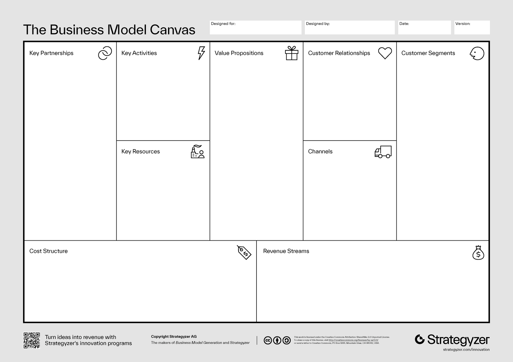
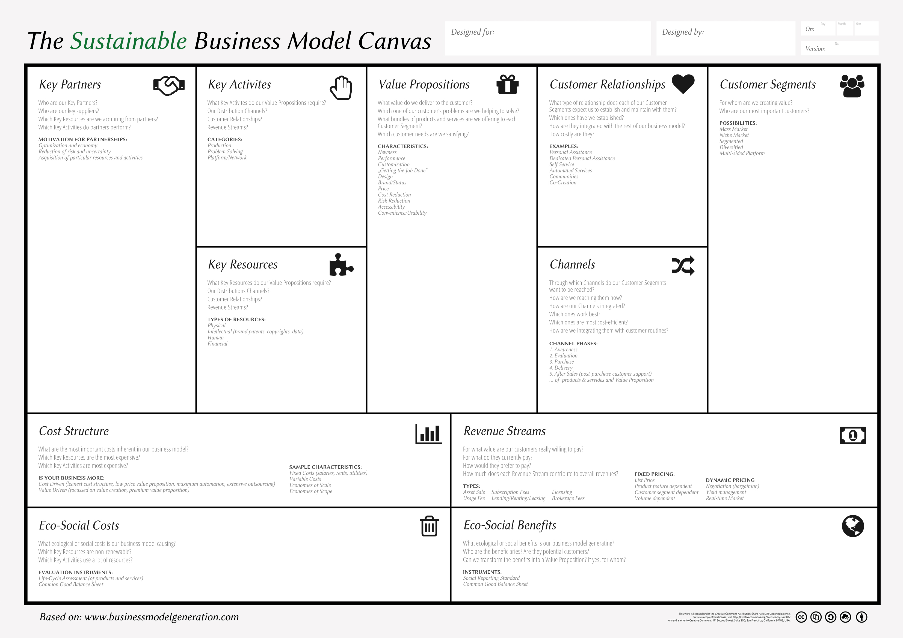

# Se faire payer pour sa passion - Support de cours

<https://github.com/heig-vd-mvp-course>

[Markdown][course-material]

L. Delafontaine et V. Guidoux, avec l'aide de GitHub Copilot

Ce travail est sous licence [CC BY-SA 4.0][license].

![Illustration principale][illustration-principale]

## Table des matières

- [Table des matières](#table-des-matières)
- [Objectifs](#objectifs)
- [Pourquoi se faire payer pour sa passion ?](#pourquoi-se-faire-payer-pour-sa-passion-)
- [Établir un business model](#établir-un-business-model)
  - [Business model canvas](#business-model-canvas)
  - [Sources de revenus](#sources-de-revenus)
- [Les moyens de paiement populaires en Suisse](#les-moyens-de-paiement-populaires-en-suisse)
- [Prestataires de paiement sur Internet](#prestataires-de-paiement-sur-internet)
  - [Stripe](#stripe)
  - [PayPal](#paypal)
  - [TWINT](#twint)
  - [Autres prestataires](#autres-prestataires)
- [Aspects légaux à respecter en Suisse](#aspects-légaux-à-respecter-en-suisse)
- [Conclusion](#conclusion)
- [À faire pour la semaine suivante](#à-faire-pour-la-semaine-suivante)
- [Ce que vous ferez ensuite](#ce-que-vous-ferez-ensuite)
- [Sources](#sources)

## Objectifs

Grâce à la méthodologie présentée jusqu'ici dans l'unité d'enseignement, vous
avez un moyen d'itérer sur votre projet.

En parallèle, vous avez appris à réaliser des applications pérennes qui
répondent à un besoin. Il est temps de vous poser la question de la monétisation
de votre projet.

Vous allez donc apprendre à vous faire payer pour votre passion. Vous allez
découvrir les différents moyens de paiement disponibles en Suisse et les
différents prestataires de paiement sur Internet.

Vous allez également découvrir les éléments légaux nécessaires pour pouvoir vous
faire payer pour votre passion.

De façon plus concise, à la fin de cette séance, vous devriez être capable de :

- Établir un business model pour son projet
- Lister les différents moyens de paiement populaires en Suisse
- Lister les différents prestataires de paiement populaires sur Internet
- Lister les éléments légaux nécessaires pour pouvoir se faire payer pour sa
  passion

## Pourquoi se faire payer pour sa passion ?

Comme vous avez pu le voir dans les cours précédents, le succès de votre
application dépends de beaucoup de facteurs : bien identifier le besoin, le
public cible, votre marché, etc. Il faut malheureusement aussi penser à la
chance. Avoir la bonne idée au bon moment avec les bonnes personnes.

Pour augmenter votre chance, c'est bien d'avoir une réserve financière pour
pouvoir vivre pendant que vous développez votre projet.

Aussi, une fois que votre projet est lancé, il faut penser à la pérennité de
votre projet. Il faut donc penser à la monétisation de votre projet.

Transformer sa passion en source de revenu permet de financer durablement votre
activité tout en vous épanouissant personnellement et professionnellement.

## Établir un business model

Il existe plusieurs modèles économiques qui permettent de se faire payer pour sa
passion. Bien choisir son modèle économique en fonction de son projet et de son
public cible est essentiel pour garantir la pérennité de son activité.

Un modèle économique, modèle d'entreprise ou business model, décrit comment une
activité crée, délivre et capture de la valeur.

Avant de se lancer dans la création d'un modèle économique, il est essentiel de
comprendre tout les éléments qui le composent. Et c'est là que la matrice
d'affaires (ou business model canvas) entre en jeu.

### Business model canvas

Le Business Model Canvas permet une vision globale et structurée de votre projet
en neuf blocs essentiels :

- **Proposition de valeur** : qu'est-ce qui rend votre produit ou service unique
  ?
- **Segments de clients** : qui sont vos clients cibles ?
- **Canaux de distribution** : comment atteignez-vous vos clients ?
- **Relations clients** : comment interagissez-vous avec vos clients ?
- **Sources de revenus** : comment générez-vous des revenus ?
- **Ressources clés** : quelles ressources sont nécessaires pour votre projet ?
- **Partenaires clés** : qui sont vos partenaires stratégiques ?
- **Activités principales** : quelles sont les activités essentielles à votre
  projet ?
- **Structure des coûts** : quels sont les coûts associés à votre projet ?

Ce modèle peut être représenté selon le canvas suivant, tiré du site
Strategyzer[^strategyzer] :

De nombreux autres modèles existent mais un intéressant que nous souhaitons vous
présenter est le Sustainable Business Model
Canvas[^sustainable-business-model-canvas]. Il est très similaire au Business
Model Canvas mais intègre aussi des aspects de durabilité de votre projet. Nous
vous conseillons de l'utiliser pour votre projet.

### Sources de revenus

Arrêtons-nous un instant sur la partie _"Sources de revenus"_ du modèle
d'affaires. Il existe plusieurs façons de se faire payer pour sa passion.

- **Business-to-business (B2B)** : vendre des produits ou services à d'autres
  entreprises.
- **Business-to-consumer (B2C)** : vendre des produits ou services directement
  aux consommateurs.
- **Inscription** : proposer un service d'abonnement ou d'adhésion.
- **À la demande** : offrir des services ou produits à la demande.

## Les moyens de paiement populaires en Suisse

Suite à la pandémie de COVID-19, les moyens de paiement en Suisse ont
considérablement évolué. Les paiements sans contact et les solutions de paiement
numériques ont gagné en popularité, rendant les transactions plus pratiques et
sécurisées.

Voici quelques-uns des moyens de paiement les plus populaires en Suisse, d'après
un article de la Migros[^migros] :

- **Paiement mobile** : téléphone portable, tablette, smartwatch, etc.
- **Cartes de débit** : physiques, non déposées pour le paiement mobile
- **Paiement en espèces** : toujours utilisé
- **Cartes de crédit** : physiques, non déposées pour le paiement mobile
- **Facture** : paiement après réception de la facture

## Prestataires de paiement sur Internet

Dans le monde numérique, plusieurs prestataires de paiement se distinguent par
leur fiabilité et leurs fonctionnalités. Voici quelques-uns des plus reconnus.

### Stripe

Un des leaders du marché, [Stripe](https://stripe.com) est idéal pour les
startups et les entreprises en croissance. Il propose une API simple à intégrer
et de nombreuses fonctionnalités.

Nous recommandons Stripe pour vos projets, car il est très simple à mettre en
place, est très bien documenté et s'intègre facilement avec de nombreux
prestataires de services, dont TWINT. La page suivante décrit toutes les
intégrations possibles :
<https://docs.stripe.com/payments/payment-methods/overview>.

### PayPal

Très utilisé à l'international, [PayPal](https://www.paypal.com) est une
solution pratique pour recevoir des paiements depuis l'étranger. La
documentation décrit comment intégrer PayPal à votre projet :
<https://developer.paypal.com/docs/checkout/>.

### TWINT

Une application suisse de paiement mobile, [TWINT](https://www.twint.ch) est
très populaire pour les transactions locales. Elle permet de payer facilement
dans les magasins, en ligne et entre personnes proches.

TWINT peut être intégré à de nombreux prestataires de paiement, y compris
Stripe. La page suivante décrit toutes les intégrations possibles :
<https://www.twint.ch/fr/clients-commerciaux/nos-solutions/boutique-en-ligne/?lang=fr#section-integration>.

### Autres prestataires

Voici quelques autres prestataires de paiement sur Internet sur lesquels nous
sommes tombés.

- **Payrexx** : un prestataire suisse qui se concentre sur les petites et
  moyennes entreprises, [Payrexx](https://payrexx.com/) propose des solutions de
  paiement adaptées aux besoins spécifiques de ce segment.
- **Mollie**: un prestataire néerlandais qui se concentre sur l'Europe
  [Mollie](https://www.mollie.com) propose des solutions de paiement adaptées
  aux besoins des entreprises européennes.
- **PayPlug** : un prestataire français qui se concentre sur les petites et
  moyennes entreprises, [PayPlug](https://www.payplug.com) propose des solutions
  adaptées aux besoins spécifiques de ce segment.

## Aspects légaux à respecter en Suisse

> [!CAUTION]
>
> **Attention :** les aspects légaux sont très importants et doivent être
> respectés.
>
> Nous ne sommes pas des experts en droit. Nous vous recommandons de consulter
> une personne compétente pour vous aider à respecter les aspects légaux de
> votre projet lorsque vous atteindrez ce stade dans votre projet.

Afin de vous faire payer pour votre passion, il est essentiel de respecter
certains aspects légaux en Suisse. Voici quelques points clés à considérer :

> [!NOTE]
>
> Nous nous présentons ici quelques aspects légaux à prendre en compte lorsque
> vous travaillez en indépendant.e sur vos projets.
>
> Les aspects légaux changent lorsque vous travaillez en tant qu'entreprise.
>
> Nous étudierons ces aspects légaux dans le cours suivant.

- **Assurances :** Il est obligatoire en Suisse de s'affilier à l'AVS (Assurance
  Vieillesse et Survivants) et de cotiser à l'AI (Assurance Invalidité) si vous
  êtes indépendant.e. Vous devez également vous assurer contre les accidents
  professionnels et non professionnels. En outre, il est recommandé de souscrire
  une assurance responsabilité civile professionnelle pour vous protéger en cas
  de dommages causés à des tiers dans le cadre de votre activité selon votre
  secteur. professionnelle.
- **Fiscalité :** Renseignez-vous sur les obligations fiscales liées à votre
  activité, notamment en matière d'impôts sur le revenu. En tant
  qu'indépendant.e, vous devez vous déclarer auprès des autorités compétentes.
- **Droit de la concurrence :** Évitez les pratiques commerciales déloyales et
  respectez les règles de la concurrence pour ne pas nuire à d'autres
  entreprises.
- **Contrats :** Si vous travaillez avec des partenaires ou des client.es, il
  est conseillé de rédiger des contrats clairs pour définir les droits et
  obligations de chaque partie.

D'excellentes ressources sont disponibles sur le site de l'Administration
fédérale pour vous aider à comprendre vos obligations :

- [admin.ch - Indépendants](https://www.bsv.admin.ch/bsv/fr/home/informations-aux/independants.html)
- [admin.ch - Les premiers pas vers l'indépendance](https://www.bsv.admin.ch/bsv/fr/home/informations-aux/kmu/fall-zu-fall/selbststaendigkeit.html)
- [admin.ch - Indépendance: mode d’emploi](https://www.kmu.admin.ch/kmu/fr/home/savoir-pratique/creation-pme/creation-entreprise/premiers-pas/devenir-independant-en-suisse-mode-d-emploi.html)

## Conclusion

Se faire payer pour sa passion nécessite une bonne compréhension des modèles
économiques, des solutions de paiement et des aspects légaux essentiels. Adaptez
ces connaissances à votre projet spécifique pour garantir sa pérennité
financière.

## À faire pour la semaine suivante

Chaque personne est libre de gérer son temps comme elle le souhaite. Cependant,
il est recommandé pour la semaine suivante de :

- Relire le support de cours si nécessaire
- Commencer à réviser pour l'évaluation de la
  [semaine 13](../../17-cours-evaluation/)

## Ce que vous ferez ensuite

La séance de projet sera consacrée à la réalisation de votre projet et des tests
utilisateurs associés.

Vous pourrez ainsi continuer à travailler sur votre projet et à le faire
évoluer.

## Sources

- [Illustration principale][illustration-principale] par
  [Fabian Blank](https://unsplash.com/@blankerwahnsinn) sur
  [Unsplash](https://unsplash.com/photos/pink-pig-figurine-on-white-surface-pElSkGRA2NU)
- [wikipedia.org](https://www.wikipedia.org/) sur
  <https://fr.wikipedia.org/wiki/Mod%C3%A8le_d%27entreprise> consulté le 7 mai
  2025

[^sustainable-business-model-canvas]:
    Sustainable Business Model Canvas,
    [www.sustainablebusinesscanvas.com](https://www.case-ka.eu/index.html%3Fp=2174.html),
    6 mai 2025

[^strategyzer]:
    Strategyzer,
    [www.strategyzer.com](https://www.strategyzer.com/library/the-business-model-canvas),
    6 mai 2025

[^migros]:
    Migros,
    [www.migros.ch](https://www.migrosbank.ch/fr/guide/paiements/cartes-especes-et-autres-quels-sont-les-moyens-de-paiement-quutilise-la-population-suisse.html),
    6 mai 2025

<!-- URLs -->

[course-material]:
	https://github.com/heig-vd-mvp-course/heig-vd-mvp-course/blob/main/15-cours-se-faire-payer-pour-sa-passion/02-support-de-cours/README.md
[license]:
	https://github.com/heig-vd-mvp-course/heig-vd-mvp-course/blob/main/LICENSE.md
[illustration-principale]:
	https://images.unsplash.com/photo-1459257831348-f0cdd359235f?fit=crop&h=720
